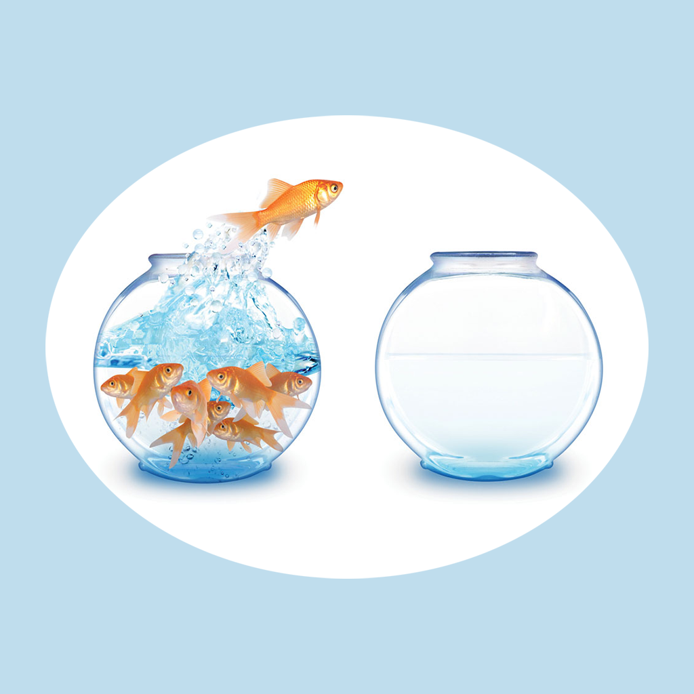

## Welcome to Fish Tank Replacement Record

Have you ever had a tank that was too small, or had too many fish, and the fish didn't grow healthily, or didn't look good? If you have this problem, then this app will help you a lot. You can record different time periods, the number of fish and the size of the tank, as well as the health of the fish you observe and your intuition. You can also record where the fish tank is placed and whether it meets your requirements. You can organize your records into a list to help you manage your fish in the proper placement of your tank.

If you have any questions, you can either leave a message or send the questions to our email address.

We will answer them for you in the first time.

### Address: sun778297ma@163.com

Thank you!
